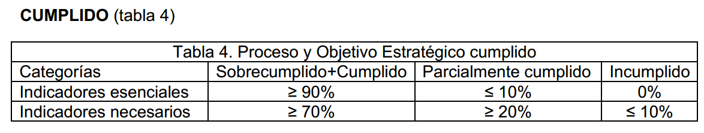

# SIGES

### Sistema para la Gestión de los Indicadores y Metas de la Universidad de Holguín

<p align="center">
  
  
  
  
  
</p>

<p align="center">
  <b>Proyecto de tesis de Ingeniería Informática · Universidad de Holguín</b><br/>
  Facultad de Informática y Matemática · Sede Oscar Lucero Moya
</p>

<p align="center">
  <a href="#-sobre-el-proyecto">Sobre el proyecto</a> ·
  <a href="#-características-principales">Funcionalidades</a> ·
  <a href="#️-galería-del-sistema">Galería</a> ·
  <a href="#-tecnologías-utilizadas">Tecnologías</a> ·
  <a href="docs/PORTFOLIO.md">Caso de estudio</a> ·
  <a href="docs/FEATURES.md">Documentación</a>
</p>

---

## 🖥️ Vista del sistema

<p align="center">
  
</p>

<p align="center"><i>Gestión centralizada de indicadores institucionales, metas, resultados y evaluación.</i></p>

---

## 📌 Sobre el proyecto

**SIGES** es una aplicación web desarrollada para digitalizar y centralizar la gestión de los indicadores y metas institucionales de la **Universidad de Holguín**.

El proyecto surge como respuesta a un proceso que se realizaba principalmente mediante documentos de Microsoft Word, hojas de cálculo de Microsoft Excel y documentos impresos. Esta forma de trabajo dificultaba la consolidación de la información, la trazabilidad de los cambios, la confiabilidad de los cálculos y la disponibilidad oportuna de resultados para la toma de decisiones.

SIGES permite administrar indicadores y metas, vincularlos con procesos universitarios y objetivos estratégicos, establecer metas por áreas y automatizar la evaluación del cumplimiento según las tablas de evaluación del Ministerio de Educación Superior (MES).

> 🎓 **Trabajo de diploma en opción al título de Ingeniero Informático.**

---

## 🔄 El problema que resuelve

| Antes | Con SIGES |
|---|---|
| Información distribuida entre Word y Excel | Gestión centralizada de indicadores y metas |
| Consolidación manual de datos | Información estructurada por procesos y áreas |
| Cálculos manuales | Cálculo automatizado del cumplimiento |
| Riesgo de errores en la evaluación | Aplicación sistemática de reglas de evaluación |
| Dificultad para consultar resultados | Resúmenes consolidados para el seguimiento |

---

## ✨ Características principales

- 📊 Gestión de indicadores institucionales.
- 🏢 Gestión de procesos universitarios.
- 🏛️ Administración de áreas, facultades y municipios.
- 🎯 Gestión de objetivos estratégicos.
- 📈 Registro de metas y resultados reales.
- ⚙️ Evaluación automatizada del cumplimiento.
- 👥 Gestión de usuarios y roles.
- 📑 Resúmenes de evaluación por procesos y objetivos.

---

# 🖼️ Galería del sistema

## 🔐 Registro y acceso de usuarios

SIGES incorpora gestión de cuentas y usuarios como parte del control de acceso al sistema.

<p align="center">
  
</p>

---

## 📊 Gestión de indicadores

Los indicadores constituyen el núcleo del sistema. Desde esta sección se administra la información necesaria para su seguimiento y evaluación.

<p align="center">
  
</p>

### Creación de un indicador

El proceso de creación está organizado por pasos, permitiendo introducir la información necesaria de manera estructurada.

<p align="center">
  
  
  
</p>

---

## 🏛️ Gestión de áreas

Administración de las áreas responsables dentro de la estructura institucional.

<p align="center">
  
</p>

---

## 🎯 Objetivos estratégicos

Los indicadores pueden relacionarse con los objetivos estratégicos para facilitar el seguimiento del cumplimiento institucional.

<p align="center">
  
</p>

---

## ⚙️ Evaluación de indicadores

SIGES calcula el porcentaje de cumplimiento y permite clasificar el resultado de acuerdo con las reglas de evaluación definidas.

<p align="center">
  
  
</p>

### Estados de evaluación

<p align="center">
  
  
</p>

Los resultados pueden clasificarse como **Sobrecumplido, Cumplido, Parcialmente cumplido, Incumplido o No evaluado**, según corresponda.

---

## 📈 Evaluación de procesos

Los resultados individuales pueden consolidarse para evaluar el comportamiento de los procesos institucionales.

<p align="center">
  
</p>

---

## 🔄 Flujo general de gestión

```text
Objetivos Estratégicos
        ↓
     Procesos
        ↓
    Indicadores
        ↓
       Metas
        ↓
Resultados Reales
        ↓
Porcentaje de Cumplimiento
        ↓
    Evaluación
        ↓
Resúmenes y seguimiento institucional
```

---

## 👥 Usuarios y roles

El sistema contempla cuatro roles diferenciados:

| Rol | Responsabilidad principal |
|---|---|
| **Administrador** | Gestiona usuarios, configuración general y evaluación del sistema |
| **Jefe de Proceso** | Gestiona indicadores asociados a su proceso |
| **Jefe de Área** | Registra resultados y participa en la gestión de metas |
| **Usuario Normal** | Accede a las funcionalidades habilitadas según sus permisos |

---

## 🛠️ Tecnologías utilizadas

| Tecnología | Uso en el proyecto |
|---|---|
| **C#** | Lenguaje principal de desarrollo |
| **.NET 10** | Plataforma de desarrollo |
| **Blazor Server** | Interfaz web |
| **SQL Server** | Persistencia de datos |
| **Entity Framework Core** | Acceso y gestión de datos |
| **FluentUI Blazor** | Componentes de interfaz |
| **ASP.NET Core** | Servicios y funcionalidades web |
| **REST API** | Comunicación mediante operaciones HTTP |

---

## 📐 Alcance funcional

El proyecto de tesis define **50 requisitos funcionales**, organizados en ocho paquetes, y **42 operaciones REST** distribuidas en seis servicios web.

La solución cubre el ciclo completo de gestión: configuración, asignación, definición de metas, registro de resultados, cálculo del cumplimiento, evaluación y consolidación.

---

## 💼 Proyecto de portfolio

SIGES representa una experiencia práctica en el desarrollo de una aplicación de gestión con reglas de negocio, roles de usuario, persistencia de datos, APIs y una interfaz web para un contexto institucional real.

📄 **[Leer el caso de estudio del proyecto →](docs/PORTFOLIO.md)**

📋 **[Ver funcionalidades documentadas →](docs/FEATURES.md)**

💼 **[Ver presentación preparada para LinkedIn →](docs/LINKEDIN.md)**

---

## 🚀 Cómo ejecutar el proyecto

1. Clona el repositorio.
2. Abre `WEB.sln` con Visual Studio o JetBrains Rider.
3. Configura la cadena de conexión y los parámetros necesarios.
4. Restaura las dependencias.
5. Ejecuta la aplicación desde el proyecto web configurado como proyecto de inicio.

> La configuración concreta puede depender del entorno de desarrollo y de los servicios configurados en el proyecto.

---

## 🎓 Contexto académico

Este proyecto fue desarrollado como **Trabajo de Diploma en opción al título de Ingeniería Informática** para la **Universidad de Holguín**, en la **Facultad de Informática y Matemática**, sede **Oscar Lucero Moya**.

El objetivo fue desarrollar un sistema web que informatizara la gestión de indicadores y metas institucionales siguiendo los lineamientos del Proyecto Estratégico del Ministerio de Educación Superior de Cuba.

---

## 👨‍💻 Autor

**José Osvaldo Verdecia Argota**

Ingeniero Informático | .NET Developer

- GitHub: https://github.com/JoseVerdecia
- Proyecto: https://github.com/JoseVerdecia/Web

---

<p align="center">
  <i>Proyecto académico desarrollado para resolver un problema real de gestión y evaluación institucional.</i>
</p>
