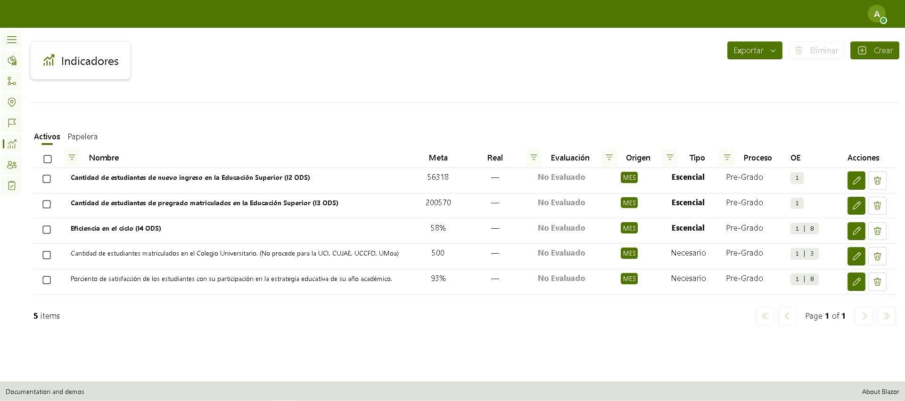
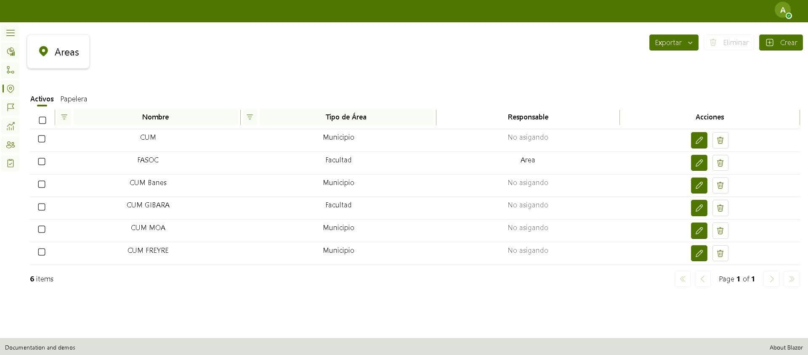
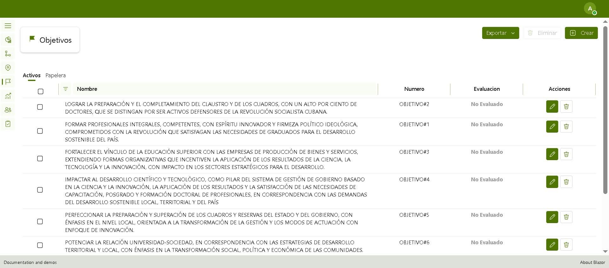

# SIGES

### Indicator and Goal Management System for the University of Holguín

  
  
  
  
  

  <b>Computer Engineering thesis project · University of Holguín</b> 
  Faculty of Computer Science and Mathematics · Oscar Lucero Moya Campus

  <a href="README.md">🇬🇧 English</a> |
  <a href="docs/README.es.md">🇪🇸 Español</a> |
  <a href="docs/README.pt-BR.md">🇧🇷 Português</a>

  <a href="#-about-the-project">About</a> ·
  <a href="#-key-features">Features</a> ·
  <a href="#-system-gallery">Gallery</a> ·
  <a href="#-technologies">Technologies</a> ·
  <a href="docs/PORTFOLIO.en.md">Case Study</a> ·
  <a href="docs/FEATURES.en.md">Documentation</a> ·
  <a href="docs/LINKEDIN.en.md">LinkedIn</a>

---

##  About the project

**SIGES** is a web application developed to digitize and centralize the management of institutional indicators and goals at the **University of Holguín**.

The project was created in response to a process that relied mainly on Microsoft Word documents, Microsoft Excel spreadsheets, and printed records. This approach made information consolidation, change traceability, calculation reliability, and timely access to results more difficult.

SIGES makes it possible to manage indicators and goals, link them to university processes and strategic objectives, define area-specific targets, and automate compliance evaluation according to the evaluation criteria of Cuba's Ministry of Higher Education (MES).

> 🎓 **Diploma thesis submitted as part of the requirements for the Computer Engineering degree.**

---

##  The problem SIGES solves

### Before

- Information distributed across documents and spreadsheets.
- Manual consolidation of data from different organizational areas.
- Manual calculation of compliance percentages.
- Risk of errors when applying evaluation rules.
- Difficulty tracking historical changes and ensuring traceability.
- Informal communication for negotiating or requesting goal changes.

### With SIGES

- Centralized management of indicators and goals.
- Structured registration of processes, areas, and strategic objectives.
- Area-specific goals.
- Recording of actual results.
- Automated calculation of compliance percentages.
- Automatic evaluation of indicators, processes, and objectives.
- User management based on responsibilities and permissions.
- Improved traceability of the institutional evaluation process.

---

##  Key features

###  Indicator management
Manage institutional indicators, including targets, actual results, type, source, associated process, and strategic objective.

###  Process management
Organize university processes and consolidate their evaluation based on the performance of their indicators.

###  Area management
Manage responsible organizational areas, including faculties and municipalities, with specific targets and results.

###  Strategic objectives
Manage strategic objectives and evaluate their fulfillment based on associated indicators.

###  Automated evaluation
The system calculates compliance and classifies results into categories such as:

- Overachieved
- Achieved
- Partially achieved
- Not achieved
- Not evaluated

###  Users and roles
The system includes four differentiated roles:

- **Administrator**
- **Process Manager**
- **Area Manager**
- **Standard User**

Each role has specific responsibilities and permissions within the management and evaluation workflow.

###  Responsibility workflow
Area managers record actual results and can request changes to goals. Process managers oversee the indicators under their responsibility and handle related requests. The administrator manages users, general configuration, and the evaluation process.

###  Evaluation summaries
SIGES provides consolidated views to analyze the status of indicators, processes, and strategic objectives.

For a more detailed description of the modules, see [docs/FEATURES.en.md](docs/FEATURES.en.md).

---

##  System gallery

### Account creation

  

### Indicator management

  

### Creating an indicator

  
  
  

### Areas and strategic objectives

  

  

### Indicator and process evaluation

  

  

  

---

##  Technologies

| Technology | Purpose |
|---|---|
| **C#** | Primary programming language |
| **.NET 10** | Development platform |
| **Blazor Server** | Web interface and user experience |
| **SQL Server** | Data persistence |
| **Entity Framework Core** | Data access and management |
| **FluentUI Blazor** | User interface components |
| **ASP.NET Core** | Web services and application functionality |
| **REST API** | Communication through HTTP operations |

---

##  Functional scope

The thesis project defines **50 functional requirements**, organized into eight packages, and **42 REST operations** distributed across six web services.

The solution is designed to manage the complete institutional indicator lifecycle: configuration, assignment, goal definition, actual-result registration, compliance calculation, evaluation, and result consolidation.

---

##  System roles

| Role | Main responsibility |
|---|---|
| **Administrator** | Manages users, general configuration, and system evaluation |
| **Process Manager** | Manages indicators associated with their process and consolidates related information |
| **Area Manager** | Records actual results and participates in goal management for their area |
| **Standard User** | Accesses features enabled according to their permission level |

---

##  Portfolio project

Beyond its academic context, SIGES represents hands-on experience building a management application with business rules, multiple user roles, data persistence, APIs, and a web interface for a real institutional scenario.

📄 **[Read the project case study →](docs/PORTFOLIO.en.md)**

---

##  Running the project

1. Clone the repository.
2. Open the `WEB.sln` solution using Visual Studio or JetBrains Rider.
3. Configure the connection string and the environment-specific parameters.
4. Restore the project dependencies.
5. Run the application from the configured web startup project.

> The exact configuration may vary depending on the development environment and services configured in the project.

---

##  Academic context

This project was developed as a **Diploma Thesis for the Computer Engineering degree** at the **University of Holguín**, Faculty of Computer Science and Mathematics, **Oscar Lucero Moya Campus**.

The research objective was to develop a web system that would computerize the management of institutional indicators and goals, following the guidelines of the Strategic Project of Cuba's Ministry of Higher Education.

---

##  Author

**José Osvaldo Verdecia Argota**

Computer Engineer | .NET Developer

- GitHub: https://github.com/JoseVerdecia
- Project: https://github.com/JoseVerdecia/Web

---

  <i>Academic project developed to solve a real institutional management and evaluation problem.</i>

